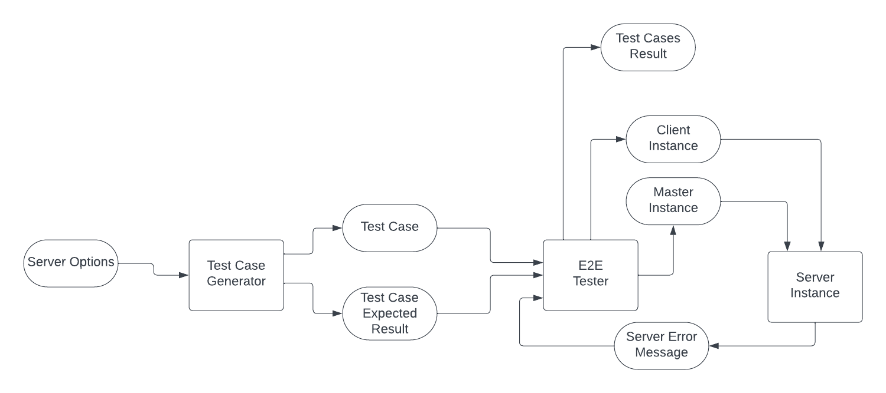

## 1. Introduction

The provided code is responsible for generating test cases. The below Design is proposed general design for testing the
server feature

## 2. Instructions to run:

Open the folder **Assignment_1**, then run the following command

```shell
python main.py
```

# Design for Testing Process

This plan outlines a comprehensive approach to testing the server's configuration feature.

## 1. Test Objectives:

Testing that the following features are working properly.
This features can be tested on a small level for the server only or a general level when the system is runnnig.

- ### Features to be tested
    - Allowing 2 clients to be connected at the same time to the same server
    - The first connected client becomes a master client instantaneously
    - The master client can edit the configurations
    - The second connected client does not have access to change the options
    - The server does not show an error if the second client tries to configure the server with same options
    - The default options are applied if the master client did not configure options
    - Two clients trying to connect simultaneously (Race conditions)

## 2. Testing Requirements:

- Access to create and run server instances
- Access to create and run client instances
- Access to connect the clients to the run
- Access to the errors output of the server
- Access to read the state of the options in the server

## 3. Testing Strategy:

Employ a combination of black-box testing (e.g. e2e testing) and white-box testing (e.g. unit tests) for comprehensive
coverage.

## 4. Testing Techniques:

- ### Unit Testing
    - Methods:
        - Employ unit tests for individual functions within the server codebase.
        - Given the codebase of the server and using the testcase generator, the created test cases will be used to test
          the functions within the server by passing options to the functions and expecting the success or error output.
        -
    - Purpose:
        - Verify the correctness of each function in isolation, ensuring they perform as expected
- ### End-to-End Testing
    - This can be achieved by creating or mocking clients that gets connected to the server
    - It requires a running instance of the server to be tested with ability to change
    - Diagram below is showing the flow of these tests:



- ### Stress Testing
    - This can be achieved by creating multiple clients and trying to connect them to the server at the same time

## 5. Testing Deliverables:

- Test cases
- Test scripts
- Unit Test Reports (How many passed and failed ? )
- Performance Test Reports
- Test Coverage

## 6. Testing Tools:

Tools can be used to automate the test cases and generate reports like:

- pytest
- selenium